# Meptrasoft Coding Assessment Platform

Enterprise-grade, multi-tenant technical assessment and evaluation ecosystem engineered for technical recruiting, proctored examinations, and hands-on developer skill verification.

---

## Architecture Overview

The platform is structured into **three distinct portal environments** operating on top of a unified TypeScript/Node.js REST backend, an isolated code sandbox runner, an AI proctoring pipeline, and a Prisma ORM data layer connected to SQLite / Turso distributed database.

### 1. Detailed End-to-End System Architecture (Start to Finish)

The comprehensive architectural pipeline below illustrates the entire platform from start to finish across all five operational phases—from test configuration and candidate onboarding, through secure authentication and sandboxed code execution, to section-aware scoring and recruiter analytics:

```mermaid
flowchart TD
    %% ─────────────────────────────────────────────────────────────
    %% Phase 1: Admin Test Setup & Candidate Provisioning
    %% ─────────────────────────────────────────────────────────────
    subgraph Phase1["Phase 1: Admin Assessment Setup & Candidate Provisioning"]
        direction TB
        AdminUser["Admin / Technical Recruiter"]
        AdminDashboard["Admin Portal Dashboard<br/>• /admin, /admin/candidates"]
        TestConfig["Test Configuration & Track Selector<br/>• Tracks: Technical MCQs, Python, SQL, or Dynamic/Both<br/>• Duration & Passing Criteria Settings"]
        QuestionShuffler["Dynamic Problem Shuffler & Allocator<br/>• Difficulty Distribution (Easy, Medium, Hard)<br/>• Anti-Collusion Randomized Question Assignment"]
        DB_OTP[("candidate_otp Table<br/>• candidate_email, otp_code<br/>• test_type, status: unused")]
        DB_Assigned[("candidate_selected_exam_problems Table<br/>• candidate_email, problem_id<br/>• language, difficulty, allocated_marks")]
        SMTPMailer["Corporate SMTP Service (Nodemailer)<br/>• Professional Zero-Emoji Email Template<br/>• Direct Portal URL + 6-Digit Passcode"]

        AdminUser -->|"Configures Track & Enrolls Candidate"| AdminDashboard
        AdminDashboard -->|"Dispatches Enrollment Payload"| TestConfig
        TestConfig -->|"Triggers Problem Randomization"| QuestionShuffler
        QuestionShuffler -->|"Stores OTP & Track Allocation"| DB_OTP
        QuestionShuffler -->|"Persists Problem Assignments"| DB_Assigned
        TestConfig -->|"Dispatches Invitation Pass"| SMTPMailer
    end

    %% ─────────────────────────────────────────────────────────────
    %% Phase 2: Candidate Authentication & Exam Entry
    %% ─────────────────────────────────────────────────────────────
    subgraph Phase2["Phase 2: Candidate Authentication & Exam Entry Gate"]
        direction TB
        CandidateUser["Candidate"]
        CandidateOTPPage["Candidate Portal Login<br/>• /candidate-otp"]
        AuthLoginAPI["POST /auth/login<br/>• Validates Email & Active 6-Digit OTP<br/>• Verifies 'unused' Status & Expiration<br/>• Generates JWT Bearer Token"]
        DB_Sessions[("server_sessions & server_exam_sessions Tables<br/>• session_id, user_id, test_type<br/>• start_time, answers_json, is_completed: false")]
        PreFlightCheck["Pre-Flight System Check (/system-check)<br/>• Mandatory Fullscreen Lock Verification<br/>• Webcam Stream Acquisition (320x240 @ 15fps)<br/>• Browser Compatibility & Anti-Snip Audit"]
        ExamRouter["Dynamic Section Router (/test-structure)<br/>• Reads Assigned test_type (MCQ / Python / SQL / Both)<br/>• Mounts Matching Examination Interface"]

        SMTPMailer -.->|"Delivers Access Pass Email"| CandidateUser
        CandidateUser -->|"Inputs Email & 6-Digit Passcode"| CandidateOTPPage
        CandidateOTPPage -->|"Submits Credentials"| AuthLoginAPI
        AuthLoginAPI -->|"Provisions Active Session"| DB_Sessions
        AuthLoginAPI -->|"Session Token Verified"| PreFlightCheck
        PreFlightCheck -->|"Launches Proctored Workspace"| ExamRouter
    end

    %% ─────────────────────────────────────────────────────────────
    %% Phase 3: Proctored Examination & Real-Time Sandboxed Execution
    %% ─────────────────────────────────────────────────────────────
    subgraph Phase3["Phase 3: Real-Time Exam Execution & Anti-Cheating Telemetry"]
        direction TB
        subgraph ExamRunners["Execution Engines by Test Track"]
            direction TB
            MonacoPython["Monaco Code Editor (Python Track)<br/>• Problem Descriptions & Starter Code<br/>• POST /run (Custom Testcase Input)<br/>• POST /submit (Private Automated Test Suites)<br/>• Isolated Child Process Execution Sandbox"]
            MonacoSQL["Monaco SQL Editor (SQL Track)<br/>• DDL Statements & Problem Schema<br/>• POST /sql/run & POST /sql/submit<br/>• In-Memory SQLite Database Sandbox"]
            MCQPortal["MCQ Assessment Engine (/problems/mcq)<br/>• Question Navigator (1 to N)<br/>• Option Selection (A, B, C, D)<br/>• Autosave via POST /exam/save-answer"]
        end

        subgraph ProctoringTelemetry["Real-Time Anti-Cheating Pipeline"]
            direction TB
            ClientVision["MediaPipe FaceLandmarker (WASM ~4 FPS)<br/>• 478 3D Facial Mesh Landmarks<br/>• Face Count Tracker & Presence Grace Period<br/>• Geometric Head Pose Estimator (Yaw/Pitch)"]
            BrowserLockdown["Browser Security Lockdown Monitor<br/>• Visibility Change & Window Blur/Focus Detection<br/>• Fullscreen Exit Trap (-60s Penalty via POST /exam/penalty)<br/>• Blocked: Copy/Paste/Cut, Context Menu, DevTools (F12)"]
            AIVisionScan["Groq Vision AI Frame Scanner<br/>• 15s Periodic & Anomaly-Triggered Snapshots<br/>• Sequential Model Pool (Llama-3.2-11b/90b-vision)<br/>• Detection: Mobile Phones, Notes, Earbuds, Multiple People"]
            ProctorBuffer["Telemetry Buffer & Dispatcher<br/>• In-Memory Queue with Ring Buffer<br/>• Flushes to POST /api/proctoring/events & /ai-verify<br/>• Real-Time Integrity Logs to proctoring_logs"]
        end

        ExamTimer["Synchronized Countdown Timer<br/>• Synchronized Session Timeout Tracking<br/>• Real-Time Clock Penalty Deductions<br/>• Auto-Submit Trigger upon Expiration"]

        ExamRouter --> MonacoPython
        ExamRouter --> MonacoSQL
        ExamRouter --> MCQPortal

        MonacoPython -.-> ClientVision
        MonacoSQL -.-> ClientVision
        MCQPortal -.-> ClientVision

        ClientVision --> ProctorBuffer
        BrowserLockdown --> ProctorBuffer
        AIVisionScan --> ProctorBuffer

        ExamTimer -.->|"Enforces Strict Time Limits"| ExamRouter
    end

    %% ─────────────────────────────────────────────────────────────
    %% Phase 4: Exam Submission & Section-Aware Scoring
    %% ─────────────────────────────────────────────────────────────
    subgraph Phase4["Phase 4: Exam Submission & Section-Aware Scoring Engine"]
        direction TB
        ExamSubmitAPI["POST /exam/submit<br/>• Triggered by Candidate Submit or Auto-Submit Timeout"]
        SingleTakeLock["Single-Take Policy Lockout<br/>• Sets candidate_otp.status = 'submitted'<br/>• Sets server_exam_sessions.is_completed = true<br/>• Permanent Lockout: Prevents Re-Entry"]
        ScoreCalculator["Section-Aware Scoring Engine (examService.ts)<br/>• Reads Candidate Assigned test_type (Strict Isolation)<br/>• MCQ Track: Evaluates answers against mcq_questions<br/>• Coding Track: Evaluates submissions from current attempt only<br/>• Eliminates Historical Cross-Contamination"]
        DB_Assessments[("assessments Table<br/>• python_score, sql_score, mcq_score<br/>• python_questions, sql_questions, mcq_questions<br/>• overall_score, max_possible_score, overall_percentage<br/>• overall_verdict, problem_testcases_json, status: evaluated")]
        CompletePage["Submission Complete Confirmation<br/>• /submission-complete"]

        MonacoPython -->|"Candidate Submits"| ExamSubmitAPI
        MonacoSQL -->|"Candidate Submits"| ExamSubmitAPI
        MCQPortal -->|"Candidate Submits"| ExamSubmitAPI
        ExamTimer -->|"Auto-Submit on Timeout"| ExamSubmitAPI

        ExamSubmitAPI --> SingleTakeLock
        ExamSubmitAPI --> ScoreCalculator
        ScoreCalculator -->|"Persists Final Evaluated Record"| DB_Assessments
        ExamSubmitAPI -->|"Redirects Candidate"| CompletePage
    end

    %% ─────────────────────────────────────────────────────────────
    %% Phase 5: Recruiter Review & Assessment Analytics
    %% ─────────────────────────────────────────────────────────────
    subgraph Phase5["Phase 5: Recruiter Analytics & Multi-Modal Audit"]
        direction TB
        AssessmentDashboardUI["Assessment Dashboard (/admin/assessments)<br/>• Ingests Evaluated Records via GET /api/reports/proctoring/"]

        subgraph DashboardFeatures["Recruiter Audit Capabilities"]
            direction TB
            CandidateTable["Candidates Assessment Table<br/>• Clean Formatted Date & Time with Full Spacing (min-w-200px)<br/>• Contextual Track Badges (Only Attended: MCQ / PY / SQL / Both)<br/>• Trust Verdict Shield (Clean, Minor Issues, Suspicious, High Risk)"]
            MultiModalReview["Code & MCQ Review Modal (CodeReviewModal.tsx)<br/>• MCQ Tests: Question text, option choices, candidate answer (green/red), correct answer, explanation<br/>• Coding Tests: Monaco code diff viewer, testcase pass matrices, stderr, execution timings"]
            ProctoringModal["Proctoring Summary Modal<br/>• Categorized Incident Audit Cards (Browser, Face, Head Pose)<br/>• Noise-Suppressed, Time-Window Scoped Attempt Incidents"]
            ExcelExport["Excel Report Generator (ExcelJS)<br/>• Multi-Sheet Export: Test Summary, Trust Audit, Performance"]
        end

        AssessmentDashboardUI --> CandidateTable
        CandidateTable --> MultiModalReview
        CandidateTable --> ProctoringModal
        AssessmentDashboardUI --> ExcelExport
        DB_Assessments --> AssessmentDashboardUI
    end

    Phase1 --> Phase2
    Phase2 --> Phase3
    Phase3 --> Phase4
    Phase4 --> Phase5
```



---

### 2. Dedicated Proctoring System Architecture (How Proctoring Works)

The following in-depth architecture diagram illustrates how proctoring works on the proctoring side of the application—from hardware capture and DOM event monitoring, through local WASM computer vision and remote LLM vision verification, to time-window scoped incident clustering and the executive Trust Verdict algorithm:

```mermaid
flowchart TD
    %% ─────────────────────────────────────────────────────────────
    %% Layer 1: Hardware & Sensor Ingestion
    %% ─────────────────────────────────────────────────────────────
    subgraph Layer1["Layer 1: Hardware & Client-Side Sensor Ingestion"]
        direction TB
        WebcamStream["Candidate Webcam (getUserMedia)<br/>• 320x240 RGB Video Stream @ 15-30 FPS<br/>• Continuous Live Video Element Input"]
        CanvasGrabber["Dynamic Canvas Frame Grabber<br/>• 640x480 JPEG Snapshot @ 0.6 Compression Quality<br/>• Captured on 15s Cadence or State Anomaly"]
        BrowserDOM["Browser DOM Security Event Listeners (BrowserMonitor.ts)<br/>• visibilitychange: Tab Switch Detection<br/>• window.blur & window.focus: Anti-Snip & External App Shield<br/>• fullscreenchange: Fullscreen Exit Traps<br/>• Clipboard Traps: Block copy, cut, paste<br/>• UI Protection: Block selectstart, dragstart, contextmenu<br/>• Keyboard Intercept: Block F12, Ctrl+Shift+I/J/C, Win+Shift+S, Alt+Tab"]
    end

    %% ─────────────────────────────────────────────────────────────
    %% Layer 2: Client-Side Computer Vision & State Machine
    %% ─────────────────────────────────────────────────────────────
    subgraph Layer2["Layer 2: Client-Side Computer Vision & RiskEngine State Machine"]
        direction TB
        MediaPipeEngine["MediaPipe FaceLandmarker (FaceDetector.ts)<br/>• WebAssembly (WASM) CPU Runtime<br/>• Throttled to ~4 FPS (250ms Minimum Cadence)<br/>• 478 3D Facial Mesh Landmarks Detection"]

        FaceClassifier["Face Count Classifier<br/>• 0 Faces: Candidate Left Camera View<br/>• 1 Face: Verified Solo Candidate (Normal)<br/>• 2+ Faces: Multiple People Detected in Room"]

        HeadPoseCalc["Geometric Head Pose Estimator<br/>• Landmark Triangulation: Nose Tip (Pt 1), Left Edge (Pt 234), Right Edge (Pt 454), Forehead (Pt 10), Chin (Pt 152)<br/>• Computes Euler Angles: Yaw (Left/Right) & Pitch (Up/Down)"]

        subgraph RiskEngineFSM["RiskEngine Finite State Machine (RiskEngine.ts)"]
            direction TB
            FaceGraceFSM["Face Presence Grace Period State Machine<br/>• 0 - 3 Seconds: Transient Gaze Buffer (No Event Emitted)<br/>• &gt; 3 Seconds: NO_FACE_WARNING Low-Severity Alert<br/>• &gt; 10 Seconds: NO_FACE High-Severity Violation<br/>• Face Re-Entry: Instant State Transition Back to OK"]
            HeadTurnFSM["Sustained Head Turn Filter<br/>• Sustained Angle Deviation &gt; 5.0 Seconds<br/>• Emits HEAD_LEFT, HEAD_RIGHT, HEAD_UP, HEAD_DOWN"]
            CooldownDeduper["Per-Event Cooldown Filter (5000ms)<br/>• Suppresses Frame-by-Frame Log Flooding<br/>• Debounces Same-Type Event Spam"]
        end

        MediaPipeEngine --> FaceClassifier
        MediaPipeEngine --> HeadPoseCalc
        FaceClassifier --> FaceGraceFSM
        HeadPoseCalc --> HeadTurnFSM
        FaceGraceFSM --> CooldownDeduper
        HeadTurnFSM --> CooldownDeduper
    end

    %% ─────────────────────────────────────────────────────────────
    %% Layer 3: Remote AI Vision Pipeline (Groq Vision LLMs)
    %% ─────────────────────────────────────────────────────────────
    subgraph Layer3["Layer 3: Remote AI Vision Verification (Groq Vision LLMs)"]
        direction TB
        ScanTrigger["Scan Trigger Controller<br/>• Periodic Trigger: Scheduled Every 15 Seconds<br/>• Immediate Anomaly Trigger: Face Count not equal to 1"]
        ModelPool["Sequential Model Pool (Round-Robin Failover)<br/>• llama-3.2-11b-vision-preview (High-Speed Inference)<br/>• llama-3.2-90b-vision-preview (Deep Verification)<br/>• Graceful Fallback to Local Vision Heuristics"]
        FraudClassifier["Multi-Vector Fraud Classifier (groqProctoringService.ts)<br/>• Mobile Phone, Tablet, or Secondary Screen Detection<br/>• Headphones, Earbuds, or AirPods Detection<br/>• Printed Notes, Books, or Paper Materials Detection<br/>• Looking Off-Screen / Gaze Deviation Detection<br/>• Multiple Unregistered Persons in Exam Environment"]
        StructuredOutput["Structured Fraud Analysis Output<br/>• face_count, mobile_phone_detected, headphones_detected<br/>• notes_or_book_detected, looking_away, suspicious_object<br/>• risk_score (0-100) & risk_level (CLEAN, LOW, MED, HIGH, CRITICAL)<br/>• Concise Incident Explanation String"]

        CanvasGrabber --> ScanTrigger
        ScanTrigger --> ModelPool
        ModelPool --> FraudClassifier
        FraudClassifier --> StructuredOutput
    end

    %% ─────────────────────────────────────────────────────────────
    %% Layer 4: Telemetry Streaming & Ingestion Buffer
    %% ─────────────────────────────────────────────────────────────
    subgraph Layer4["Layer 4: Telemetry Streaming & Ingestion Buffer"]
        direction TB
        ViolationQueue["ViolationTracker In-Memory Queue (ViolationTracker.ts)<br/>• Ring Buffer for Recent Events (Max 20 for UI Display)<br/>• Auto-Flushes when Batch Reaches 10 Events or Timer Expires<br/>• Emergency Flush via navigator.sendBeacon on Page Unload"]
        API_Events["POST /api/proctoring/events<br/>• Batch Telemetry Ingestion Handler"]
        API_AIVerify["POST /api/proctoring/ai-verify<br/>• AI Snapshot Analysis Ingestion Handler"]
        DB_ProctoringLogs[("proctoring_logs & proctoring_events Tables<br/>• exam_id (session_id), candidate_id<br/>• violation_type, message, timestamp<br/>• risk_score, severity, metadata")]
        RealTimeEnforcement["Real-Time Exam Clock Penalty & Lockdown<br/>• POST /exam/penalty: Deducts -60s on Tab Switch / Exit<br/>• Mandatory Fullscreen Re-Prompt Modal Overlay"]

        BrowserDOM --> ViolationQueue
        CooldownDeduper --> ViolationQueue
        ViolationQueue --> API_Events
        StructuredOutput --> API_AIVerify
        API_Events --> DB_ProctoringLogs
        API_AIVerify --> DB_ProctoringLogs
        BrowserDOM -.->|"Tab Switch / Fullscreen Exit"| RealTimeEnforcement
        StructuredOutput -.->|"Critical Score &gt;= 80"| RealTimeEnforcement
    end

    %% ─────────────────────────────────────────────────────────────
    %% Layer 5: Backend Analytics, Incident Clustering & Trust Scoring
    %% ─────────────────────────────────────────────────────────────
    subgraph Layer5["Layer 5: Backend Analytics Engine & Incident Clustering (assessmentService.ts)"]
        direction TB
        TimeWindowScoper["Strict Attempt Time-Window Scoper<br/>• Bounds Logs Strictly to [login_time - 1 min, submit_time + 1 min]<br/>• Eliminates Historical Cross-Assessment Contamination"]
        NoiseFilter["Noise Suppression Filter<br/>• Strips Informational Events: AI_SCAN_CLEAN (Routine Scans)<br/>• Strips WINDOW_FOCUS, FACE_DETECTED"]
        IncidentClustering["30-Second Rolling Window Clustering Algorithm<br/>• Groups Consecutive Rapid Frame Events within 30s Window<br/>• Collapses 300+ Raw Frame Spams into Distinct Actionable Incidents"]
        WeightedScoring["Weighted Trust Deduction Algorithm<br/>• Browser Violations (Tab Switch, Fullscreen Exit, DevTools, Copy): -15 pts<br/>• Face Violations (Missing Face, Multiple Faces): -5 pts<br/>• Head Pose Violations (Looking Away): -3 pts<br/>• trust_score = Math.max(0, 100 - Total Deductions)"]
        TrustVerdictEngine["Executive Trust Verdict Generator<br/>• Clean: Trust Score = 100 (0 Incidents)<br/>• Minor Issues: Trust Score 80 to 99<br/>• Suspicious: Trust Score 60 to 79<br/>• High Risk: Trust Score under 60"]

        DB_ProctoringLogs --> TimeWindowScoper
        TimeWindowScoper --> NoiseFilter
        NoiseFilter --> IncidentClustering
        IncidentClustering --> WeightedScoring
        WeightedScoring --> TrustVerdictEngine
    end

    %% ─────────────────────────────────────────────────────────────
    %% Layer 6: Recruiter Presentation & Audit UI
    %% ─────────────────────────────────────────────────────────────
    subgraph Layer6["Layer 6: Recruiter Dashboard Presentation & Audit View"]
        direction TB
        TrustBadge["Trust Verdict Shield Badge (CandidatesAssessmentTable.tsx)<br/>• Emerald Shield: Clean Integrity Verified (100 pts, 0 incidents)<br/>• Amber Shield: Minor Issues (e.g. 1 transient head pose event)<br/>• Orange Shield: Suspicious (e.g. 1 tab switch / window blur)<br/>• Red Shield: High Risk (Multiple cheating indicators or device detected)"]
        SummaryModalUI["Proctoring Summary Modal<br/>• Overall Trust Score & Status Banner<br/>• Categorized Incident Cards: Browser Security, Face Detection, Head Orientation<br/>• Exact Incident Timestamps, Severity Tags, and Deduplicated Counts"]

        TrustVerdictEngine --> TrustBadge
        TrustVerdictEngine --> SummaryModalUI
    end

    WebcamStream --> MediaPipeEngine
    WebcamStream --> CanvasGrabber
```



---

## The Three Sides (Portals) Explained

### 1. Admin Portal (`/admin/*`)
Engineered for recruiters, technical interviewers, and system administrators to manage the complete assessment lifecycle:
* **Candidate Management**:
  * Manual and bulk candidate onboarding.
  * Individualized test-type assignments: **Python**, **SQL**, **Combined (Both)**, or **Technical MCQs**.
  * Randomized question shuffling per candidate to prevent collusion.
* **Assessment Dashboard**:
  * Real-time candidate status tracking (`registered`, `in-progress`, `submitted`, `evaluated`).
  * Performance score cards, percentage calculations, and recruitment verdict tagging (`Selected`, `Shortlisted`, `Under Review`, `Rejected`).
  * Granular question-level time duration and score breakdowns.
* **Proctoring Violation Inspector**:
  * Live timeline of candidate integrity events: tab switches, window blurs, exiting fullscreen, missing webcam face, or multiple faces detected.
  * Risk scoring metrics for objective evaluation.
* **Submission Review & Code Diff Modal**:
  * Syntax-highlighted code inspector showing submitted code vs. problem expectations.
  * Test case pass/fail matrices with exact stdout, stderr, and execution timings.
* **Question Bank Management**:
  * Problem authoring for Python coding tasks (statements, starter code, test suites).
  * SQL problem creator with schema DDL, seed data SQL, and expected query validation.
  * Technical multiple-choice questions (MCQs) with topic categorizations.
* **Automated Credential Dispatcher**:
  * Direct SMTP integration to send professional branded access passes with one-time passcodes (OTP).

### 2. Candidate Proctored Examination Portal (`/candidate-otp`, `/coding`)
The secure, locked-down testing environment for candidates taking formal assessments:
* **Identity & Passcode Authentication**:
  * Entry gated by email and a 6-digit one-time passcode (OTP) with 24-hour expiration.
* **Pre-Flight System Verification**:
  * Webcam permissions check and browser compatibility audit prior to test entry.
* **AI Webcam & Environment Proctoring**:
  * Real-time browser-based computer vision for face presence, face orientation, and multiple-person detection.
  * Strict browser lockdown: detects and logs window blurs, tab switching, copy/paste attempts, and fullscreen exits.
* **Integrated Monaco Code Editor**:
  * High-performance editor supporting Python and SQL syntax.
  * Configured with company dark/light themes, keyboard shortcuts, and code formatting.
* **In-Session Test Runner**:
  * Execution of public test cases with immediate feedback on standard output and assertion failures.
  * SQL execution engine running queries against temporary schema instances.
* **Automated Timer & Submission Pipeline**:
  * Synchronized examination countdown timer with warning banners.
  * Automatic submission and session lockout when the time limit expires.

### 3. Practice & Problem Solving Portal (`/practice/*`, `/practice-problems`)
A self-paced, unproctored playground for developers to sharpen coding and database skills:
* **Curated Problem Catalogs**:
  * Algorithmic programming challenges filtered by difficulty (Easy, Medium, Hard).
  * Real-world SQL scenarios covering aggregations, joins, window functions, and subqueries.
  * Multiple-choice questions testing core computer science fundamentals.
* **Interactive Sandbox Execution**:
  * Instant code compilation and execution against sample datasets without proctoring constraints.
  * Comprehensive test feedback to facilitate learning and self-assessment.

---

## Technology Stack

### Frontend
| Component | Technology | Description |
| :--- | :--- | :--- |
| **Framework** | React 18 + Vite | Fast, modern client application bundling |
| **Language** | TypeScript | Strictly typed UI components and API contracts |
| **Styling** | Custom Design System + TailwindCSS | Cohesive brand design tokens (`#ffa116` amber & deep slate neutrals) |
| **Code Editor** | Monaco Editor (`@monaco-editor/react`) | Industry-standard IDE experience in the browser |
| **Proctoring** | TensorFlow.js / BlazeFace & Visibility API | Browser-side face tracking and focus integrity events |
| **Icons** | React Icons (`react-icons/fi`, `lucide-react`) | Consistent iconography throughout all dashboards |

### Backend & Infrastructure
| Component | Technology | Description |
| :--- | :--- | :--- |
| **Runtime** | Node.js | Fast, scalable asynchronous backend runtime |
| **Framework** | Express.js + TypeScript | RESTful routing, authentication, and proctoring endpoints |
| **ORM & DB** | Prisma ORM + SQLite / Turso | Type-safe queries, schema migrations, and relational storage |
| **Execution Sandbox** | Child Process / In-Memory SQLite | Sandboxed code and query evaluation against test suites |
| **Email Delivery** | Nodemailer (Pooled SMTP) | Corporate email generation with CID logo embedding and zero-emoji format |
| **Security** | JWT, bcrypt, Rate Limiting | Protected admin routes and secure candidate session handling |

---

## Directory Structure

```plaintext
Coding_test_platform/
├── backend/
│   ├── prisma/
│   │   └── schema.prisma         # Prisma data models (Users, Assessments, Proctoring, Problems)
│   ├── src/
│   │   ├── config/               # Environment & database configurations
│   │   ├── controllers/          # Request handlers for admin, exam, auth, runner
│   │   ├── middlewares/          # JWT auth, validation, rate limiting
│   │   ├── routes/               # API route definitions
│   │   │   ├── admin.ts          # Candidate management, reports, dashboard
│   │   │   ├── exam.ts           # Candidate exam lifecycle & submission
│   │   │   ├── proctoring.ts     # Telemetry logging & violation risk scoring
│   │   │   ├── runner.ts         # Code & SQL execution sandbox
│   │   │   └── problems.ts       # Question bank CRUD
│   │   ├── services/             # Business logic (OTP, Proctoring, Runner, Exam)
│   │   ├── utils/                # Email templates, helpers, token utils
│   │   └── index.ts              # Express application entrypoint (Port 8000)
│   ├── package.json
│   └── tsconfig.json
│
├── frontend/
│   ├── src/
│   │   ├── components/           # Reusable UI cards, tables, modals, sidebars
│   │   │   ├── admin/            # Admin sidebar layouts, diff modals, violation viewer
│   │   │   └── ui/               # Design system buttons, spinners, toast notifications
│   │   ├── constants/            # Nav items, test configurations, design tokens
│   │   ├── pages/                # Three-side portal views
│   │   │   ├── AdminDashboard.tsx         # Side 1: Admin Candidate Management
│   │   │   ├── AssessmentDashboard.tsx    # Side 1: Admin Assessment Analytics
│   │   │   ├── ChooseTestTypePage.tsx     # Side 1: Test Type Configuration
│   │   │   ├── SendMailPage.tsx           # Side 1: Credentials & OTP Email Dispatch
│   │   │   ├── CandidateOTP.tsx           # Side 2: Candidate Passcode Gate
│   │   │   ├── CodingPage.tsx             # Side 2: Proctored Monaco Exam Room
│   │   │   ├── PracticeProblems.tsx       # Side 3: Practice Problem Arena
│   │   │   └── PracticeCodingPage.tsx     # Side 3: Practice Sandbox
│   │   ├── proctoring/           # Face detection, tab tracking, fullscreen hooks
│   │   ├── index.css             # Unified brand color tokens & dark/light theme
│   │   └── main.tsx              # Router definitions & app mount (Port 3005)
│   ├── package.json
│   └── vite.config.ts
│
├── start.sh                      # One-click startup script for backend & frontend
└── install.sh                    # Dependency installation script
```

---

## Getting Started

### Prerequisites
* **Node.js**: v18.0.0 or higher
* **npm**: v9.0.0 or higher
* **Python 3**: Available on system PATH for running Python test submissions
* **C/C++ Build Tools**: Required for native SQLite bindings if applicable

### Installation

1. **Clone the repository**:
   ```bash
   git clone <repo-url>
   cd Coding_test_platform
   ```

2. **Run the installation script**:
   ```bash
   chmod +x install.sh
   ./install.sh
   ```
   *Alternatively, install manually:*
   ```bash
   cd backend && npm install
   npx prisma generate
   npx prisma db push
   cd ../frontend && npm install
   ```

3. **Configure Environment Variables**:
   * Create `backend/.env`:
     ```env
     PORT=8000
     JWT_SECRET=your_jwt_secret_key_here
     FRONTEND_URL=http://localhost:3005
     DATABASE_URL=file:./dev.db

     # Optional SMTP configuration for live email dispatch
     SMTP_HOST=smtp.gmail.com
     SMTP_PORT=587
     SMTP_USERNAME=your_email@domain.com
     SMTP_PASSWORD=your_app_password
     ```

### Running Locally

Launch both frontend and backend concurrently using the root startup script:

```bash
chmod +x start.sh
./start.sh
```

| Service | URL | Default Credentials |
| :--- | :--- | :--- |
| **Frontend Application** | `http://localhost:3005` | - |
| **Backend REST API** | `http://localhost:8000` | - |
| **Admin Portal Login** | `http://localhost:3005/admin` | Configured admin user |
| **Candidate Portal** | `http://localhost:3005/candidate-otp` | Issued via OTP email |
| **Practice Portal** | `http://localhost:3005/practice` | Public access |

---

## Key Platform Workflows

### Candidate Examination Flow
1. **Admin Assignment**: Admin enrolls a candidate with their email, name, and selected test track (Python / SQL / MCQ / Both).
2. **Access Pass Email**: Backend issues an OTP and transmits an official, emoji-free invitation email containing login credentials.
3. **Authentication**: Candidate visits `/candidate-otp`, inputs email and OTP, and receives session tokens.
4. **Proctored Session**: Candidate verifies camera access, enters fullscreen, and proceeds to solve problems in the Monaco IDE.
5. **Evaluation**: Submissions are compiled against public and private test cases.
6. **Results & Audit**: Final scores and recorded proctoring anomalies are streamed to the recruiter's Assessment Dashboard for immediate review.